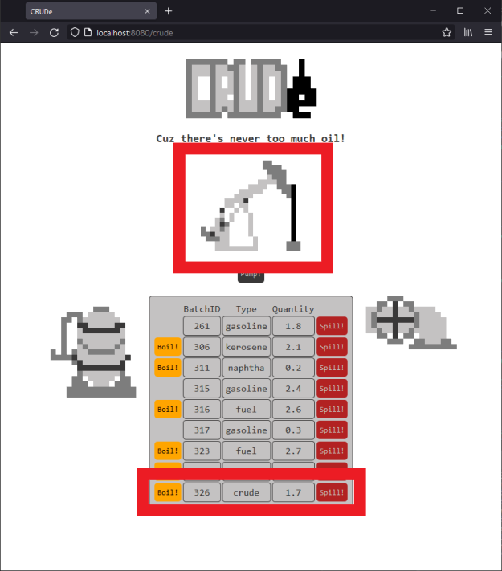
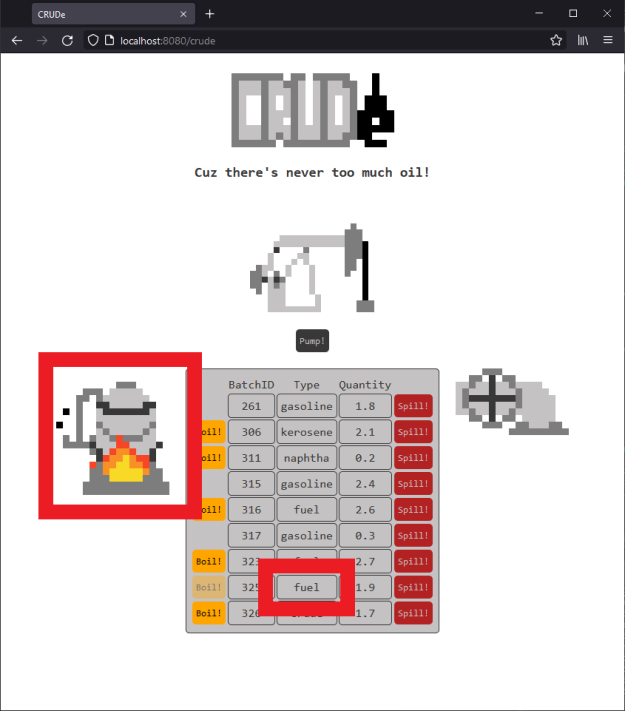
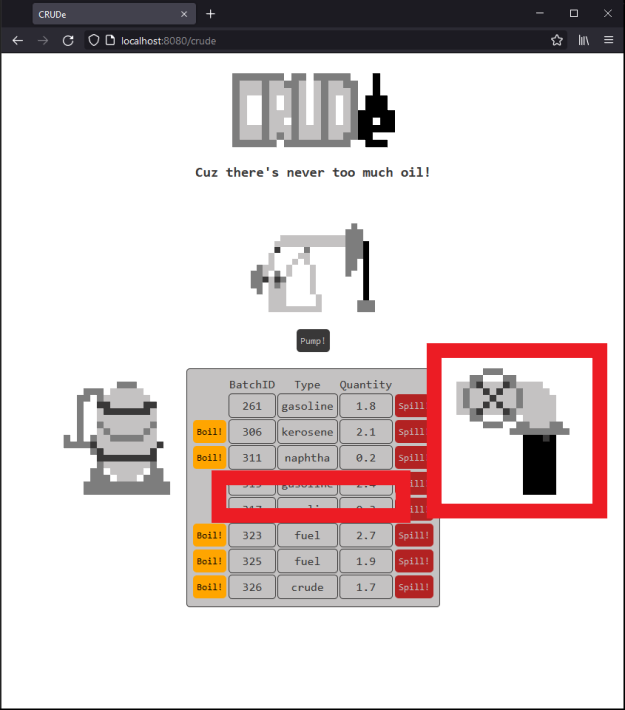

# CRUDe
Small CRUD linked to mySQL database with html interface

There's never too much oil! Pump, refine and spill (and look at) all the oil! Enter localhost:8080/crude in a browser to open the html page. Use the html interface to send requests to a very lite CRUD. That CRUD is linked to a mySQL databse. Some flair is added with custom made Visuals. And some artistic liberties were taken with the whole oil process.

---------

When you get to the home page by entering "localhost:8080/crude" in a browser, you'll see a table with all the previously created batches of delicious oil. You'll also see three types of buttons to interact with the oil database. Read further for a description of each button types. You can return to the home page at anytime by clicking the "CRUDe" logo at the top.

Press the "Pump!" button to create a batch of crude oil. It will get its own Batch ID. The quantity will be randomized. You can see the new oil batch added at the bottom of the table. And watch the oil drill pump that oil!

Press the "Boil!" button next to a batch to refine that batch. It will raise the quality of the oil by one grade every time you press the button until it reaches the "gasoline" state. The grades from lowest to highest are: "crude", "fuel", "diesel", "kerosene", "naphtha" and "gasoline". You can see the type change inside the table. And watch the refiner boil that oil!

Press the "Spill!" button next to a batch to destroy that batch. It will totally remove the chosen batch. The destroyed batch will be remove from the table. And watch the pipe spill that oil!

---------

made using:

java
html
css

eclipse
mysql
github
lombok
maven
springboot
thymeleaf
hibernate
tomcat

